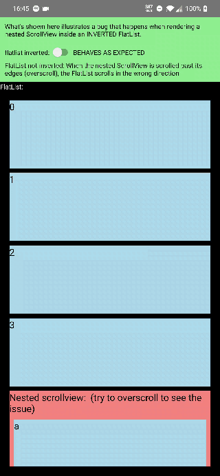

## Description
What's illustrated in this project a bug that happens when rendering a nested ScrollView inside an INVERTED FlatList.

### Expected overscroll behaviour (happens with FlatList not inverted)
FlatList not inverted: When the nested ScrollView is scrolled past its edges (overscroll), the FlatList scrolls in the correct direction

[Better quality video here](./docs/fullvid.mp4)

### Buggy behaviour (happens with FlatList INVERTED)

Flatlist inverted: When the nested ScrollView is scrolled past its edges (overscroll), the FlatList scrolls in the wrong direction

[Better quality video here](./docs/fullvid.mp4)

